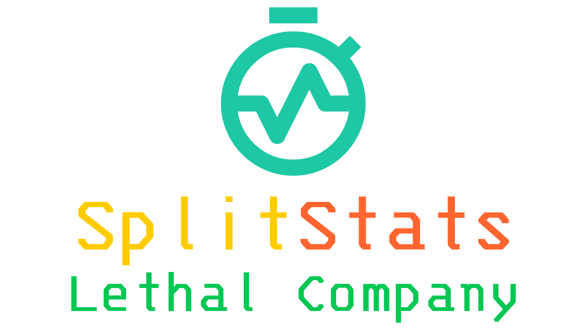
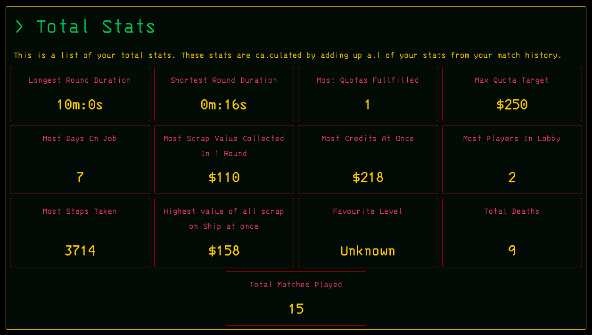
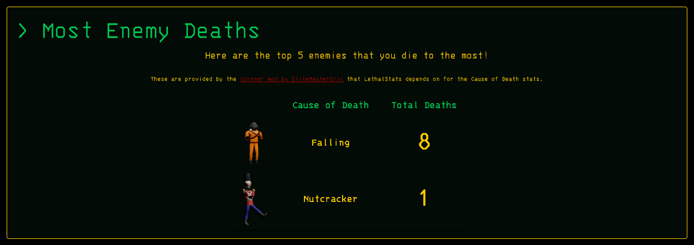
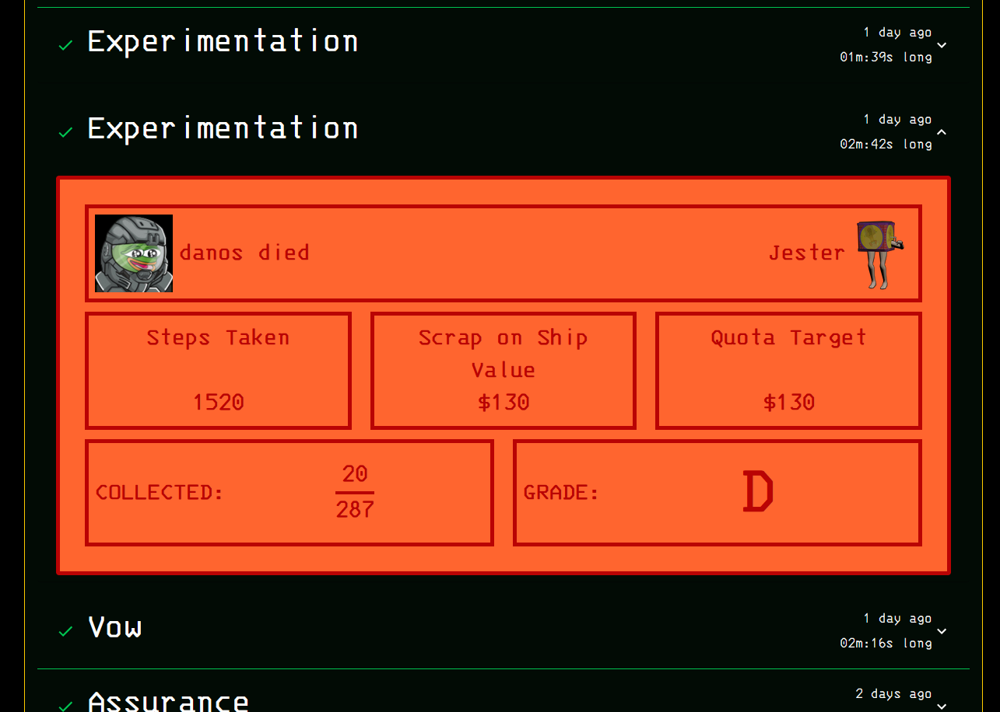

# Introduction
A Mod for the game Lethal Company that collects and displays your stats at https://lethal.splitstats.io

## Pre-Release Notice
Just as a quick note, this mod is not at V1.0 yet, it is still in the testing and development stage.

## Requirements/Dependencies
This mod requires the following mods to function.

1. [BepInExPack](https://thunderstore.io/c/lethal-company/p/BepInEx/BepInExPack/)
2. [Coroner](https://thunderstore.io/c/lethal-company/p/EliteMasterEric/Coroner/)

## Installation
To install the LethalStats Mod, you can either:

1. Download the mod from the Thunderstore page (Recommended)
2. Download the latest release from the releases of this [GitHub repository](https://github.com/danielmccluskey/LethalStatsMod/releases).

## Usage
Once the mod is installed and enabled, it will automatically collect your stats and post them to the website. You can access your stats by visiting the website https://lethal.splitstats.io and entering your Steam ID.

## Preview Images

### Total Stats
A total of your stats calculated from your match history

### Most Deaths to Enemies
A list of your top 5 most died to enemies.

### Match History
A post-game summary of your different matches.

## Contributing
If you would like to contribute to the development of LethalStatsMod, please submit a pull request or contact me on Twitter @Danosw_

## License
LethalStatsMod is released under the MIT License. Do what you want with it.

